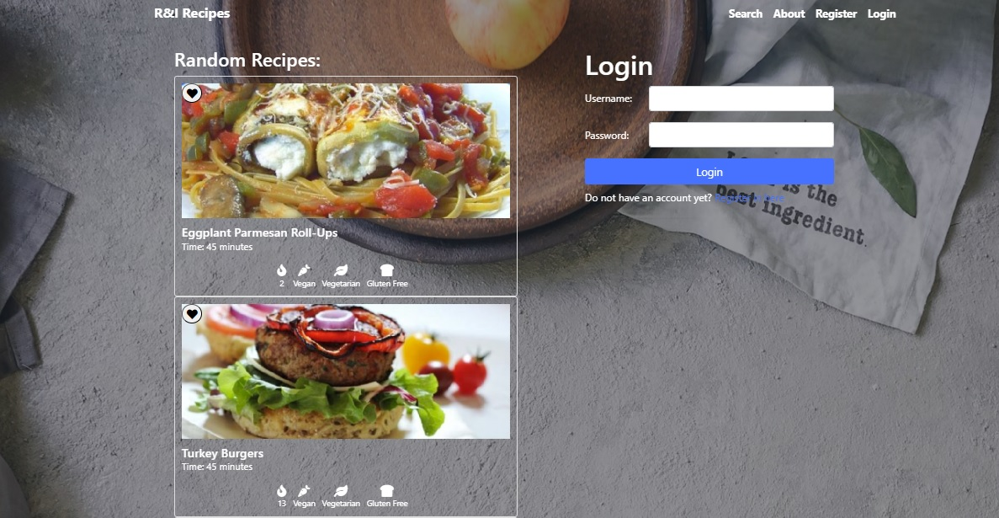
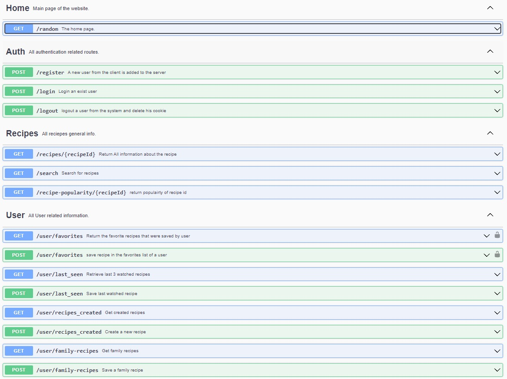

# Recipes Website
This is a web application that allows users to search for and explore various recipes.

## Introduction
The Recipes project is a recipe search system designed to provide users with access to a diverse database of recipes. Users can view recipe details, preparation instructions, and even save their favorite family recipes. The project is divided into frontend and backend components, each fulfilling specific requirements set by the client.
The backend of the Recipes project serves as the foundation for the entire application. It handles data storage, retrieval, authentication, and other crucial operations required to support the frontend functionalities.

## Technology Stack
Frontend: Vue.js
Backend: Express.js (Node.js)
Database: MySQL
Authentication: JSON Web Tokens (JWT)
External data source: Spoonacular API

 

## Backend API
 